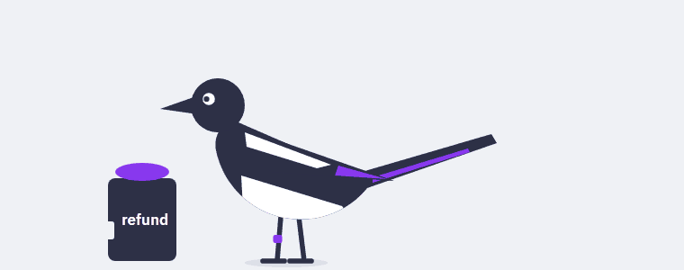
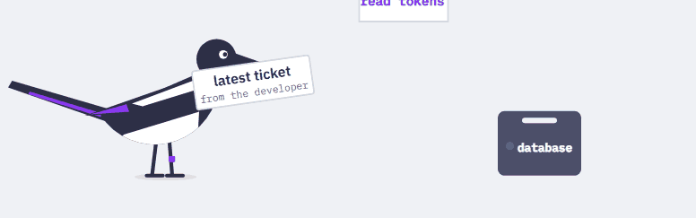
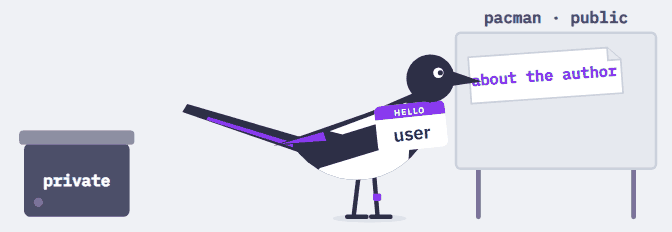
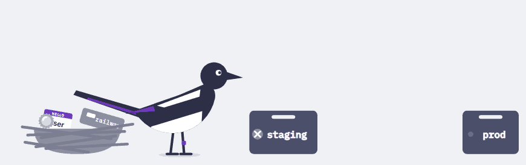
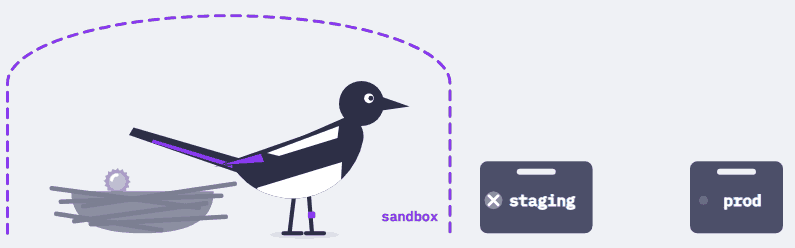
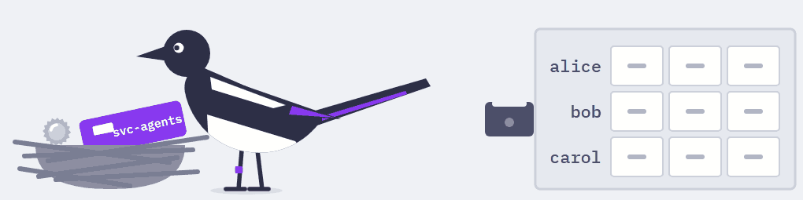
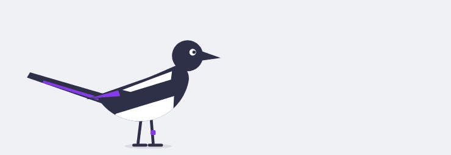

# Awesome Agent Hardening 

  

> Limiting what AI agents can reach, change, and break.

This list is for developers who build agents. It assumes any model output can be the worst possible one: an attacker wrote it, the user asked for the wrong thing, or the model got it wrong on its own. Nothing here relies on the model behaving. Each section takes one thing an agent can be given, lists public incidents with their primary sources, and then lists controls that hold outside the model.

Each control names the principle it applies:

| Principle         | What holds whatever the model says                                                                 |
| ----------------- | -------------------------------------------------------------------------------------------------- |
| Least privilege   | The agent reaches only what was granted for this task.                                             |
| Isolation         | What the agent runs stays in a sandbox with no secrets, and nothing outside trusts what it writes. |
| Data flow control | Data goes only to people allowed to read everything it came from.                                  |
| Output handling   | Model output is data; the system decides what it may trigger.                                      |
| Recoverability    | Any agent mistake can be rolled back, and the system caps how big it can get.                      |

## Contents

- [Principles](#principles)
- [Model Only](#model-only)
- [Mail and RAG](#mail-and-rag)
- [Tools and MCP](#tools-and-mcp)
- [Shell and Files](#shell-and-files)
- [Browser](#browser)
- [Memory](#memory)
- [Skills and Marketplaces](#skills-and-marketplaces)
- [Unattended Agents](#unattended-agents)
- [Identity and Tokens](#identity-and-tokens)
- [Human Approval and Classifiers](#human-approval-and-classifiers)
- [Frameworks](#frameworks)
- [Lectures](#lectures)

## Principles

- [The lethal trifecta for AI agents](https://simonwillison.net/2025/Jun/16/the-lethal-trifecta/) - An agent with private data, untrusted content and a way to send data out can be made to leak it. Author's note: don't try to remove the untrusted leg by sorting inputs into trusted and untrusted, because the user's own request or a plain model mistake produces the worst output too; cut access to private data or the way out instead.
- [Design Patterns for Securing LLM Agents against Prompt Injections](https://arxiv.org/abs/2506.08837) - Six patterns that limit what an agent can still do after it has read untrusted input.
- [Defeating Prompt Injections by Design](https://arxiv.org/abs/2503.18813) - CaMeL takes control flow from the trusted request, so injected text cannot change which tools run.
- [Securing AI Agents with Information-Flow Control](https://arxiv.org/abs/2505.23643) - Data flow control: FIDES from Microsoft Research labels data by confidentiality and integrity and enforces the policy in the planner, outside the model.
- [FIDES](https://github.com/microsoft/fides) - Data flow control: code and a tutorial for the paper above.
- [The Attacker Moves Second](https://arxiv.org/abs/2510.09023) - Adaptive attacks broke twelve published prompt injection defenses, so a filter can tell you something is off but cannot stop the leak.

## Model Only

  

- [Moffatt v. Air Canada, 2024 BCCRT 149](https://loyaltylobby.com/wp-content/uploads/2024/02/Air-Canada-Tribunal-2024bccrt149.pdf) - A tribunal held the airline to a refund rule its chatbot made up. Prices and policy have to come from the system, not from model text.

## Mail and RAG

  

- [EchoLeak](https://www.aim.security/lp/aim-labs-echoleak-blogpost) - Zero-click leak from Microsoft 365 Copilot: instructions in an email made the answer carry data in an image URL, and the browser fetched it through a Teams proxy.
- [EchoLeak: The First Real-World Zero-Click Prompt Injection Exploit](https://arxiv.org/abs/2509.10540) - The paper on the same chain, with the classifier bypass and the reference-style Markdown image.
- [CVE-2025-32711](https://msrc.microsoft.com/update-guide/vulnerability/CVE-2025-32711) - Microsoft fixed it on the server side, and customers had nothing to do.

## Tools and MCP

  

### Incidents

- [GitHub MCP Exploited: Accessing private repositories via MCP](https://invariantlabs.ai/blog/mcp-github-vulnerability) - A public issue led an agent holding the user's token to copy private repository data into a public pull request.
- [Supabase MCP Security: How Prompt Injection Leaked Private Tables](https://generalanalysis.com/blog/supabase-mcp-blog) - A support ticket told Cursor, connected with the service role key, to read a table of integration tokens and post it back into the ticket.
- [Asana MCP server incident](https://status.asana.com/incidents/5b9hhtgs3mxs) - A bug could show one organization's data to MCP users in other organizations; Asana kept the server offline for twelve days.
- [Malicious postmark-mcp package](https://postmarkapp.com/blog/information-regarding-malicious-postmark-mcp-package) - A fake Postmark MCP server on npm quietly copied every sent email to the attacker.

### Controls

- [MCP Security Best Practices](https://modelcontextprotocol.io/docs/2026-07-28/tutorials/security/security_best_practices) - Least privilege: why a server must not pass client tokens through or act as a confused deputy.
- [MCP Authorization Security Considerations](https://modelcontextprotocol.io/specification/2026-07-28/basic/authorization/security-considerations) - Least privilege: what the specification requires of tokens and scopes.

## Shell and Files

  

### Incidents

- [Your AI wants to nuke your database](https://blog.railway.com/p/your-ai-wants-to-nuke-your-database) - Railway on a coding agent that found an account-scoped API token on the user's machine and deleted a production volume; the data was recovered.
- [AI coding tool Replit wiped a database](https://fortune.com/2025/07/23/ai-coding-tool-replit-wiped-database-called-it-a-catastrophic-failure/) - During a code freeze the agent ran destructive commands against production, then claimed rollback was impossible.
- [AWS-2025-015](https://aws.amazon.com/security/security-bulletins/AWS-2025-015/) - An over-scoped GitHub token let an attacker ship a wiper prompt in the Amazon Q Developer extension, which failed to run.
- [S1ngularity: What Happened, How We Responded, What We Learned](https://nx.dev/blog/s1ngularity-postmortem) - Malicious Nx releases drove local AI coding CLIs to search the machine for secrets.
- [The Week of Sandbox Escapes](https://www.pillar.security/blog/the-week-of-sandbox-escapes) - Pillar Security got out of the sandboxes of Cursor, Codex CLI, Gemini CLI and Antigravity without breaking any of them: the agent wrote a Python interpreter, a Git hook or a task config that the host later ran, or reached the Docker socket.

### Controls

  

- [Making Claude Code more secure and autonomous with sandboxing](https://www.anthropic.com/engineering/claude-code-sandboxing) - Isolation: the filesystem and the network are isolated together, and permission prompts dropped by 84%.

## Browser

- [Agentic browser security: indirect prompt injection in Perplexity Comet](https://brave.com/blog/comet-prompt-injection/) - Hidden text in a Reddit comment made the browser agent open the user's logged-in email, read a one-time code and post it in the thread.

## Memory

- [Spyware Injection Into Your ChatGPT's Long-Term Memory](https://embracethered.com/blog/posts/2024/chatgpt-macos-app-persistent-data-exfiltration/) - A prompt injection wrote itself into ChatGPT's long-term memory and leaked later conversations through image URLs.

## Skills and Marketplaces

- [Malicious ClawHub skills target OpenClaw users](https://opensourcemalware.com/blog/malicious-clawhub-skills-target-openclaw-users) - 386 fake crypto trading skills talked users into running stealers for exchange keys and wallets.
- [Malicious OpenClaw skills used to distribute Atomic macOS Stealer](https://www.trendaisecurity.com/en-us/resources-insights/trendai-security-blog/malicious-openclaw-skills-used-to-distribute-atomic-macos-stealer) - The setup steps of these skills installed an infostealer on the user's Mac.

## Unattended Agents

- [OpenClaw Defaults Ship Insecure and Shodan Already Found Them](https://www.toxsec.com/p/openclaw-is-a-wildly-insecure) - Gateways open to the internet trusted anything that looked like local traffic.
- [Widespread OpenClaw Exploitation by Multiple Threat Groups](https://flare.io/learn/resources/blog/widespread-openclaw-exploitation) - Flare counted more than 30,000 compromised instances used to steal keys and read messages.
- [Hacking Moltbook](https://www.wiz.io/blog/exposed-moltbook-database-reveals-millions-of-api-keys) - A social network for agents left its database open without row-level security and exposed 1.5 million API keys.
- [What security teams need to know about OpenClaw](https://www.crowdstrike.com/en-us/blog/what-security-teams-need-to-know-about-openclaw-ai-super-agent/) - What a personal super-agent can reach once it is installed.

## Identity and Tokens

  

### Incidents

- [Salesloft Drift AI supply chain attack](https://www.finra.org/rules-guidance/guidance/salesloft-drift-AI-supply-chain-attack) - Attackers used stolen OAuth tokens of a chat agent integration to export Salesforce data; FINRA counts more than 700 affected organizations.
- [Data theft from Salesforce instances via Salesloft Drift](https://cloud.google.com/blog/topics/threat-intelligence/data-theft-salesforce-instances-via-salesloft-drift) - Google Threat Intelligence on how the integration's tokens were used. The model played no part.
- [Cloudflare's response to the Salesloft Drift incident](https://blog.cloudflare.com/response-to-salesloft-drift-incident/) - One victim's account: its support cases held 104 API tokens that customers had pasted, and Cloudflare rotated them all.

### Controls

- [RFC 8693, OAuth 2.0 Token Exchange](https://www.rfc-editor.org/rfc/rfc8693) - Least privilege: one narrow token that names both the user and the agent acting for them.
- [OWASP Non-Human Identities Top 10](https://owasp.org/www-project-non-human-identities-top-10/) - Least privilege: the usual ways service and agent credentials go wrong.
- [Software and AI agent identity and authorization](https://www.nccoe.nist.gov/sites/default/files/2026-02/accelerating-the-adoption-of-software-and-ai-agent-identity-and-authorization-concept-paper.pdf) - Data flow control: a NIST NCCoE concept paper on identifying and authorizing agents.

## Human Approval and Classifiers

  

- [Auto mode is now the default in Claude Code](https://claude.com/blog/auto-mode-default-in-claude-code) - In Anthropic's test people caught 13.6% of dangerous commands and the classifier caught 89%. Both still miss some, so they belong inside a sandbox.
- [How we built Claude Code auto mode](https://www.anthropic.com/engineering/claude-code-auto-mode) - How the permission classifier is built and which overeager actions it still misses.

## Frameworks

- [OWASP Top 10 for LLM Applications](https://genai.owasp.org/llm-top-10/) - The common risk list, handy as a checklist once the controls above are in place.
- [MITRE ATLAS](https://atlas.mitre.org/) - Adversary tactics and techniques against AI systems, in the style of ATT&CK.
- [MAESTRO](https://cloudsecurityalliance.org/blog/2025/02/06/agentic-ai-threat-modeling-framework-maestro) - The Cloud Security Alliance's threat modeling framework for agentic AI.

## Lectures

[Безопасность агентов для тех, кто их строит](lectures/shad-2026-09.md), Yandex School of Data Analysis, 29 September 2026, in Russian, with [slides](lectures/shad-2026-09.pdf). One agent gets its capabilities one at a time, and each one comes with a real incident and the place to stop it.

## Contributing

Contributions are welcome. Please read the [contribution guidelines](contributing.md) first.

## Footnotes

Pica the magpie is the mascot of the author's talks, drawn after Charley Harper. Each scene shows the problem its section is about.
