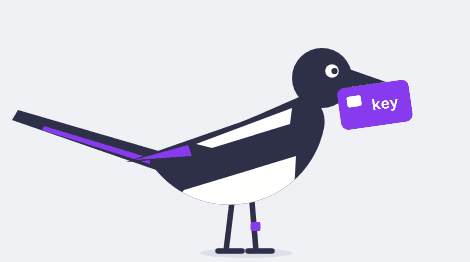

# Безопасность агентов для тех, кто их строит

Лекция в ШАД 29 сентября 2026, перед хакатоном. Материалы идут в том же порядке, что и в лекции.

  

## Главное правило

Считайте ответ модели уже максимально вредным. Неважно, откуда пришёл текст: его написал атакующий, пользователь попросил не то или модель ошиблась сама. Важно, до чего дотянется худший ответ и что остановит его вне модели.

Отсюда и отношение к [lethal trifecta](https://simonwillison.net/2025/Jun/16/the-lethal-trifecta/) Саймона Уиллисона. Агент утекает, когда у него сразу есть приватные данные, недоверенный ввод и канал наружу. Убирать «недоверенный ввод», деля вход на доверенный и недоверенный, бесполезно: худший ответ получается и из просьбы самого пользователя, и из обычной ошибки модели. Резать надо доступ к данным или канал наружу.

Фильтр на входе границей не станет. Если он ловит 99% инъекций, а атакующий пробует 100 раз, хотя бы одна попытка пройдёт с вероятностью 1 − 0,99¹⁰⁰ ≈ 63%. Адаптивные атаки справляются ещё лучше: [The Attacker Moves Second](https://arxiv.org/abs/2510.09023).

На каждой ступени три вопроса: что беречь, до чего дотянется худший ответ и что его остановит вне модели.

## Агент X

Персональный агент вроде [OpenClaw](https://www.crowdstrike.com/en-us/blog/what-security-teams-need-to-know-about-openclaw-ai-super-agent/) или [Hermes](https://hermes-agent.nousresearch.com/docs/). Он читает почту, ходит в репозитории, запускает команды, листает веб, помнит прошлые разговоры, ставит навыки и сам работает по расписанию. В лекции эти возможности подключаются по одной.

## Ступень 0: только модель

- [Moffatt v. Air Canada](https://loyaltylobby.com/wp-content/uploads/2024/02/Air-Canada-Tribunal-2024bccrt149.pdf). Чат-бот придумал правило возврата, и трибунал обязал компанию его выполнить. Цены и условия должны браться из системы, а не из текста модели.

## Ступень 1: почта и RAG

- EchoLeak: [разбор Aim Labs](https://www.aim.security/lp/aim-labs-echoleak-blogpost), [статья на arXiv](https://arxiv.org/abs/2509.10540), [бюллетень Microsoft](https://msrc.microsoft.com/update-guide/vulnerability/CVE-2025-32711). Письмо атакующего ждёт, пока пользователь задаст Copilot обычный вопрос. Модель вставляет в ответ картинку с данными в адресе, и браузер загружает её через прокси Teams.
- Где остановить: интерфейс не загружает адреса, которые написала модель. Проверка: заглушка вместо модели отвечает картинкой с адресом атакующего, и туда не уходит ни одного запроса.

## Ступень 2: инструменты и MCP

- [GitHub MCP, разбор Invariant Labs](https://invariantlabs.ai/blog/mcp-github-vulnerability). Хватило issue в публичном репозитории, чтобы агент с токеном пользователя перенёс приватные данные в публичный pull request.
- Где остановить: выдать токен на один репозиторий задачи, а в harness запретить запись в публичное из сессии, которая читала приватное.
- Так же устроен [FIDES](https://arxiv.org/abs/2505.23643) из Microsoft Research ([код](https://github.com/microsoft/fides)): на данных стоят метки конфиденциальности и целостности, а политику проверяет планировщик, вне модели.
- Про токены: [MCP Security Best Practices](https://modelcontextprotocol.io/docs/2026-07-28/tutorials/security/security_best_practices) и [RFC 8693](https://www.rfc-editor.org/rfc/rfc8693) об обмене токенов.

## Ступень 3: shell и файлы

- [PocketOS, рассказ Railway](https://blog.railway.com/p/your-ai-wants-to-nuke-your-database). Агент нашёл на машине токен Railway и удалил продовый том вместе с бэкапами. Railway данные вернул.
- Где остановить: в песочнице нет токенов, а бэкапы лежат там, куда агент не пишет. [Песочница Claude Code](https://www.anthropic.com/engineering/claude-code-sandboxing) изолирует и файлы, и сеть.
- Подтверждать каждую команду или доверить это классификатору? В [посте Anthropic](https://claude.com/blog/auto-mode-default-in-claude-code) люди поймали 13,6% опасных команд, классификатор 89%; [как устроен auto mode](https://www.anthropic.com/engineering/claude-code-auto-mode). Классификатор лучше уставшего человека, но место ему внутри песочницы.

### Песочница держит, пока снаружи не доверяют тому, что пишет агент

[The Week of Sandbox Escapes](https://www.pillar.security/blog/the-week-of-sandbox-escapes), Pillar Security, 20 июля 2026. Исследователи выбрались из песочниц четырёх агентов для разработки и ни одну при этом не взломали. Каждый раз агент записывал файл, который потом исполнял кто-то снаружи песочницы, или дотягивался до службы с правами на хосте.

- Cursor. Агент подменил интерпретатор Python в virtualenv, и его запустило расширение, работающее без песочницы. Второй путь шёл через git: fsmonitor срабатывал из каталога с нестандартным именем. Третий через конфиг хуков в `.claude`, из-за которого команды выполнялись мимо песочницы. Первое исправлено, два других закрыты в версии 3.0.0.
- Codex CLI. Агент добрался до сокета Docker. Ещё список «безопасных» команд проверял имя git, но не опасные аргументы; это закрыто в версии 0.95.0.
- Gemini CLI. Тот же сокет Docker.
- Antigravity. Профиль Seatbelt на macOS был построен на запретах и оставил агенту часть возможностей ОС. Ещё агент писал конфиг задач `.vscode`, который хост потом исполнял сам. Google понизил серьёзность обеих находок.

Авторы сводят это к четырём причинам. Песочница на списке запретов проигрывает сложности ОС. Конфиги рабочей папки на деле работают как исполняемый код. Список разрешённых команд смотрит на имя, а не на весь вызов. Привилегированные службы на машине стоят вне песочницы.

Главный вывод статьи: «If an agent gets to write the future inputs of systems, it was never sandboxed in the first place». Зона поражения агента включает всё, что он может записать и чему потом доверяет хост. У своего инструмента стоит спросить: что агент может записать, кто снаружи этому доверяет, какие локальные службы ему доступны и какие команды проходят без подтверждения.

## Ступени с 4 по 7

- Браузер: [Perplexity Comet, разбор Brave](https://brave.com/blog/comet-prompt-injection/). Остановит отдельный профиль браузера, в котором нет сессий пользователя.
- Память: [SpAIware](https://embracethered.com/blog/posts/2024/chatgpt-macos-app-persistent-data-exfiltration/). Остановят те же проверки, которые работают в каждой сессии. Память при этом видна пользователю, и её можно сбросить.
- Навыки: [вредоносные навыки ClawHub](https://opensourcemalware.com/blog/malicious-clawhub-skills-target-openclaw-users). Навыки ставит человек, и агент не пишет туда, откуда они загружаются.
- Агент без человека: [открытые инсталляции OpenClaw](https://www.toxsec.com/p/openclaw-is-a-wildly-insecure) и [массовая эксплуатация по данным Flare](https://flare.io/learn/resources/blog/widespread-openclaw-exploitation). Размер ущерба ограничивают лимиты и откат в самой системе.

## Всё сводится к пяти принципам безопасности

| Принцип                           | Что держится при любом ответе модели                                                                                     |
| --------------------------------- | ------------------------------------------------------------------------------------------------------------------------ |
| Минимальные привилегии            | Агент дотягивается только до того, что выдано под эту задачу.                                                            |
| Изоляция                          | Что бы агент ни исполнил, это остаётся в песочнице без чужих секретов, и снаружи никто не доверяет тому, что он написал. |
| Контроль потоков данных и доступа | Данные уходят только к тем, кому их можно читать.                                                                        |
| Обработка вывода                  | Ответ модели это данные, а не команда.                                                                                   |
| Восстановимость                   | Любую ошибку агента можно откатить, а её размер ограничен самой системой.                                                |

## Фреймворки

[OWASP Top 10 for LLM Applications](https://genai.owasp.org/llm-top-10/), [MITRE ATLAS](https://atlas.mitre.org/) и [MAESTRO](https://cloudsecurityalliance.org/blog/2025/02/06/agentic-ai-threat-modeling-framework-maestro) пригодятся как чек-лист, когда меры вне модели уже стоят.

Остальные материалы по темам лежат в [основном списке](../README.md).
